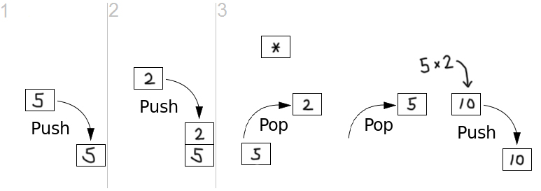

# 계산기에 대한 로직

### EX ) (1 + 2) * 3 - ( ( 7 + 9  ) / 4 + 2 )

후위 표기식을 사용하여 해결해야한다고 생각했다. 

### 후위표기식이란?
피연산자를 먼저 쓰고 그 뒤에 연산자가 나오는 형태의 식을 말합니다.

우리가 평소에 사용하는 중위 표기식 1 + 2 는 후위 표기식으로 1 2 + 로 표현할수있습니다.

후위표기식은 왼쪽부터 오른쪽으로 순차적으로 읽습니다. 피연산자는 지나치고, 연산자( +,-,*,/ )가 나오게 되면 연산자 앞의 두개의 숫자로 연산을 진행합니다. 
예를들어 1 2 3 X + 과 가은 후위표기식이 있다고 하면 첫번째 연산자 X 를만나 시점에서 2 X 3을 진행하고, 다음 연산자 + 에서 1과 2 X 3결과의 연산을 진행합니다.

## 후위표기식 변환 알고리즘은 스택을 이용하여 합니다
### 스택을 이용하여 중위표기식을 후위표기식으로 변환하기 위해서는 다음과 같은 규칙을 적용해야합니다.

* (숫자)는 바로 출력합니다.

* 괄호 ( 가 나온 경우, 스택에 push를 해줍니다.

* 괄호 ) 가 나온 경우, 스택의 Top부터 열린 괄호 ( 가 나오기까지의 노드들을 순서대로 pop하며 출력합니다. 

* 연산자(+,-,*,/)가 나오고, 스택이 비어있는 경우 연산자를 바로 스택에 넣어줍니다.
  * 만약 스택이 비어있지 않다면, 현재의 연산자와 스택의 요소들의 우선순위를 비교합니다. 현재 연산자가 스택의 Top보다 우선순위가 낮거나 같다면 스택을 pop 하고 출력해줍니다. 이런식으로 현재 연산자보다 우선위가 높은 Top이 나올때까지 반복합니다. 마지막으로 연산자를 스택에 push합니다.
  * -------------------------------------------------------------
  * 예를 들어 2 + 2 * 2 라는 식이 있고 네번째 루프 즉 연산자 * 의 루프에 있다고 가정해 봅시다. 스택의 Top은 +이므로 * 와 우선순위를 비교합니다. 곱셈은 덧셈보다 우선순위가 높으므로 출력하지 않고 그냥 *을 스택에 push합니다. 

* 만약 스택에 연산자가 남아 있는 경우 마지막에 모두 출력해줍니다.  

# 스택을 이용한 후위표기식의 계산
### 중위 표기식 : ( 5 * 2 ) + ( 200 + 25 ) / 2

### 후위 표기식 : 5 2 * 200 25 + 2 / +

* 후위표기식을 계산하는 방법도 스택을 이용합니다.
* 우선 후위 표기식에 있는 요소들을 왼쪽부터 차례대로 읽어갑니다. 
* 요소가 숫자인 경우 스택에 push해주고, 요소가 문자인 경우 스택에서 두 숫자를 꺼내 연산을 진행합니다.
* 연산 결과를 다시 스택에 넣어줍니다. 이런식으로 마지막까지 모든 연산이 수행된다면 후위표기식의 계산 결과만 남게됩니다.

#### 출처 : https://lamarr.dev/codingtest/2020/04/15/01-stack_postfix_notation_result.html

# 계산기 계산식 작성중 예외처리

1. 여는 괄호앞에는 숫자가 있으면 x를 붙이고 추가, 닫는 괄호앞에는 연산기호가 있다면 오류 메세지 발생. (O) 
2. 괄호의 개수가 여는 괄호와 닫는 괄호의 개수가 다를때 오류메세지 발생 (O)
3. 
